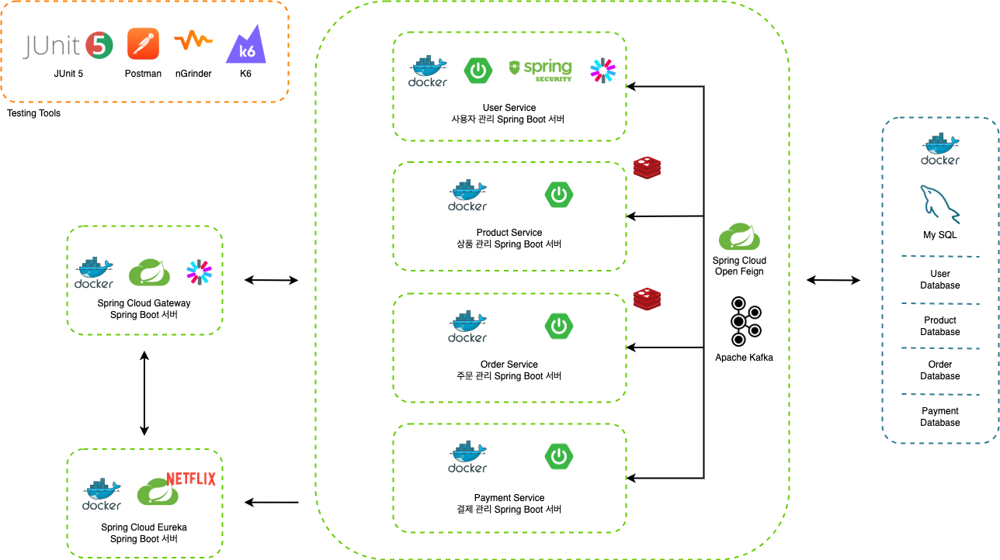
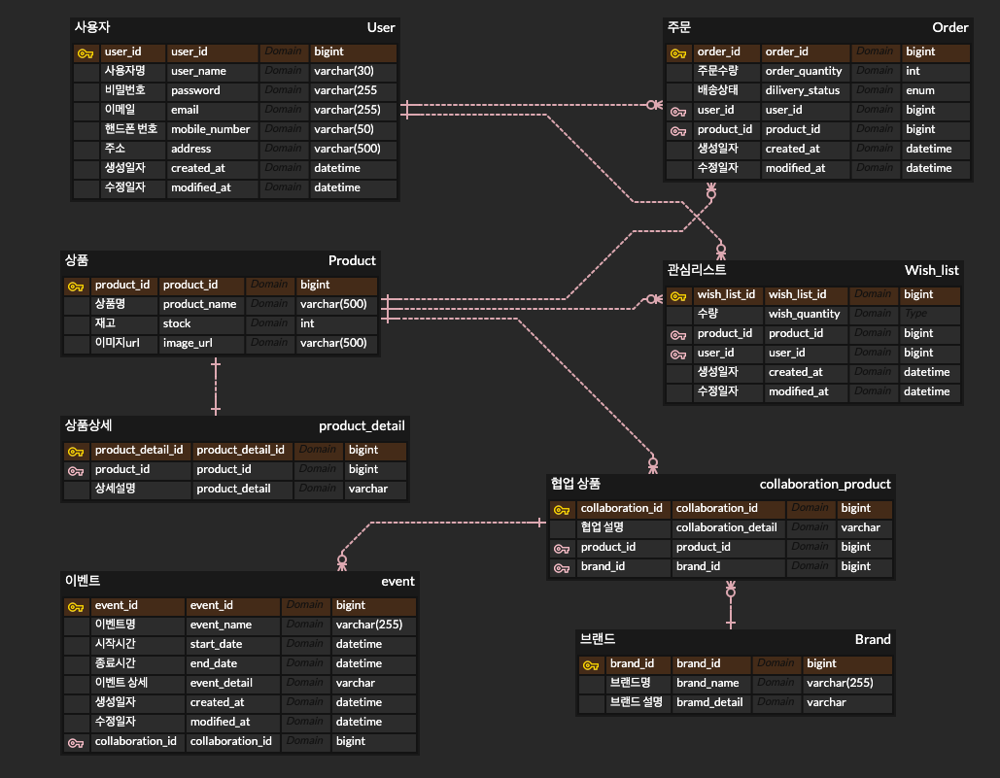

# 🏕 Collaboration Limited Edition 프로젝트
## 프로젝트 소개

- 캠핑 브랜드와 패션 브랜드의 콜라보 한정판 상품 판매/구매 서비스
- 사용자는 브랜드에서 올린 콜라보 한정판 상품을 정해진 시간에 준비된 재고만큼 선착순으로 구매

<details>
<summary style="font-size: 1.2em; font-weight: bold">프로젝트 실행 방법</summary>
<div markdown="1">
<ul>
<li>도커 실행 명령어

```Docker
run 
```
</li>
<li>222</li>
</ul>
</div>
</details>

### 기술 스택

<details>
<summary style="font-size: 1.2em; font-weight: bold">Backend</summary>
<div markdown="1">
<ul>
<li>Spring Boot</li>
<li>Spring Security, JWT</li>
<li>Spring Data JPA</li>
<li>Kafka</li>
<li>MSA(API Gateway, Spring Eureka)</li>
</ul>
</div>
</details>

<details>
<summary style="font-size: 1.2em; font-weight: bold">DB</summary>
<div markdown="1">
<ul>
<li>MySQL</li>
<li>Redis</li>
</ul>
</div>
</details>

<details>
<summary style="font-size: 1.2em; font-weight: bold">DevOps</summary>
<div markdown="1">
<ul>
<li>Docker</li>
<li>Docker Compose</li>
<li>Gradle</li>
</ul>
</div>
</details>

<details>
<summary style="font-size: 1.2em; font-weight: bold">Test</summary>
<div markdown="1">
<ul>
<li>Junit5</li>
<li>Postman</li>
<li>nGrinder</li>
<li>K6</li>
</ul>
</div>
</details>

## 💡 기획
### 주요 기능
- 사용자 서비스
  - 이메일 인증
  - 회원가입
  - 로그인
- 상품 서비스
  - 상품 등록: 선착순 상품, 일반 상품
  - 상품 조회
  - 재고 관리
- 주문 서비스
  - 관심 상품 관리
  - 상품 주문: 선착순 상품, 일반 상품
- 결제 서비스
  - 결제 프로세스
  - 
### ERD


### 시스템 아키텍처


# 💡 기술적 구현
## 1 초에 알림 500 개 제한
- 우선, 1초에 알림을 500 개 이상이 진행되는지 체크
- 500 개 이상의 알림이 1초 안에 보내진다면 rate limiter 활용하여 500개 제한
### 문제
- 알림 보내는 로직 500개 데이터를 로컬에서 테스트 해보니 1600ms 이상 소요
- 500개의 알림을 보낼 때마다 재고상태를 확인하다보니 아무리 Redis 에서 가져온다고 하더라도 로컬 환경에서는 1초 안으로 처리 안되는 듯
- 성능 개선이 필요
#### 수정 전 코드
```java
private void sendAlarm(Product product) {
    // 재입고 알림 설정 유저 select
    List<ProductUserNotification> alarmUsers = productUserNotificationRepository.findAllByProductOrderByIdAsc(product.getId());

    // 알림 전송 시점에 재고 수량 MySQL 에서 가져와서 Redis 에 저장
    redisRepository.saveProductStockCount(product);

    int checkIndex = 0;
    for(ProductUserNotification productUserNoti : alarmUsers) {
        // 재고 수량 체크
        int stockCount = redisRepository.findProductStockCount(product);
        // 재고 수량이 0이면 더이상 알림 보내지 않음.
        if(stockCount == 0) {
            // 품절에 의한 알림 발송 중단 상태 저장
            redisRepository.saveProductRestockStatus(productUserNoti.getProduct(), RestockAlarmStatusEnum.SOLD_OUT.getStatus());

            // 마지막으로 알림 보낸 사용자 저장
            redisRepository.saveLastNotificationUser(productUserNoti.getProduct(), productUserNoti.getUser());
            break;
        }
        // 알림 설정 유저에게 알림 send

        // 알림 내용 저장 Redis 에 productId, userId 키로 잡아서 저장
        redisRepository.saveProductUserNotificationInfo(productUserNoti.getProduct(), productUserNoti.getUser());
        // 마지막 사용자인 경우
        if(checkIndex == alarmUsers.size()-1) {
            // 알림 완료 상태 저장
            redisRepository.saveProductRestockStatus(productUserNoti.getProduct(), RestockAlarmStatusEnum.COMPLETED.getStatus());

            // 마지막으로 알림 보낸 사용자 저장
            redisRepository.saveLastNotificationUser(productUserNoti.getProduct(), productUserNoti.getUser());
        }
        checkIndex++;
    }
}
```
#### K6 를 사용한 성능 테스트

- 가상 유저수:1, 5번 반복 조건으로 테스트
- 해당 api 평균 속도는 1.86s 소요
- 로컬 환경이지만 성능 개선에 대한 고려가 필요해 보임
### 해결 과정
- 최초 데이터 조회 후 500번 반복문만 테스트해보니 425ms 소요
- 500번 반복될 때마다 Redis 에 저장하지 않고 끝난 후 데이터베이스에 저장해야 할 것 같은데, 그렇게 되면 중간에 재고상태가 sold out 이 되었을 때 해당 반복을 멈추게 하는 로직이 필요
- 과제의 특성상 비동기 방식을 고려하지 않기 때문에 멀티 쓰레드를 이용하여 재고 상태를 체크 고려 &rarr; 병렬 처리를 사용하게 되면 알림 요청의 순서를 완벽히 보장할 수 없음.
- Spring 의 ApplicationEventPublisher 기능을 활용한 재고 체크 로직 구현

#### 수정 후 코드
- 알림을 보낼 때마다 매번 재고 수량을 DB 에서 가져오지 않고 재고가 0이 되는 경우 이벤트 처리 
- Redis 에 알림 사용자 내역 저장을 매번 진행하지 않고 List 에 담아서 한번에 저장
```java
@EventListener
    public void handleStockChangeEvent(StockChangeEvent event) {
        // 재입고 알림 설정 유저 select
        List<ProductUserNotification> alarmUsers = productUserNotificationRepository.findAllByProductOrderByIdAsc(event.getProductId());
        // 알림 발송 후 한 번에 저장하기 위한 배열 변수
        List<String> userIds = new ArrayList<>();

        int checkIndex = 0;
        for(ProductUserNotification productUserNoti : alarmUsers) {
            // 재고가 0일 경우 알림을 중단하는 로직
            if (event.getNewQuantity() == 0) {
                // 알림 중단 로직 추가
                // 품절에 의한 알림 발송 중단 상태 저장
                redisRepository.saveProductRestockStatus(productUserNoti.getProduct(), RestockAlarmStatusEnum.SOLD_OUT.getStatus());

                // 마지막으로 알림 보낸 사용자 저장
                redisRepository.saveLastNotificationUser(productUserNoti.getProduct(), productUserNoti.getUser());
                break;
            } else {
                // Redis 에 저장할 값 한번에 저장하기 위한 로직
                userIds.add(String.valueOf(productUserNoti.getUser().getId()));

                // 마지막 사용자인 경우
                if(checkIndex == alarmUsers.size()-1) {
                    // 알림 완료 상태 저장
                    redisRepository.saveProductRestockStatus(productUserNoti.getProduct(), RestockAlarmStatusEnum.COMPLETED.getStatus());

                    // 마지막으로 알림 보낸 사용자 저장
                    redisRepository.saveLastNotificationUser(productUserNoti.getProduct(), productUserNoti.getUser());
                }
                checkIndex++;
            }
        }

        // 알람 사용자가 있고 보낸 사용자가 있으면 Redis 에 값 저장
        if(!alarmUsers.isEmpty() && !userIds.isEmpty()){
            System.out.println("alarmUsers.get(0).getProduct().getId() = " + alarmUsers.get(0).getProduct().getId());
            userIds.forEach(System.out::println);
            redisRepository.saveProductUserNotificationInfoList(alarmUsers.get(0).getProduct(), userIds);
        }
    }
```
#### 수정 후 K6 를 사용한 성능 테스트

- 가상 유저수:1, 5번 반복 조건으로 테스트
- 500개 알림을 보내는 api 평균 속도 1.04s 소요

### rate limiter 활용한 1초에 500번 알림 제한
- Resilience4j 사용한 500회 제한
#### 코드
```java
// 1초에 500번만 호출을 허용
@RateLimiter(name = "sendNotificationLimiter", fallbackMethod = "sendNotificationFallback")
public void sendAlarm(ProductUserNotification productUserNoti, int checkIndex, List<String> userIds, int lastIdx) {
    // Redis 에 저장할 값 한번에 저장하기 위한 로직
    userIds.add(String.valueOf(productUserNoti.getUser().getId()));

    // 마지막 사용자인 경우
    if(checkIndex == lastIdx) {
        // 알림 완료 상태 저장
        redisRepository.saveProductRestockStatus(productUserNoti.getProduct(), RestockAlarmStatusEnum.COMPLETED.getStatus());

        // 마지막으로 알림 보낸 사용자 저장
        redisRepository.saveLastNotificationUser(productUserNoti.getProduct(), productUserNoti.getUser());
    }
}

// Rate limit을 초과했을 때 호출되는 fallback 메서드
public void sendNotificationFallback(ProductUserNotification productUserNoti, int checkIndex, List<String> userIds, int lastIdx, Throwable throwable) {
    int retryCount = 0;
    long backoffTime = 1000; // 초기 대기 시간 1초

    while (retryCount < 3) {
        retryCount++;
        try {
            Thread.sleep(backoffTime); // 지수 백오프 적용
            sendAlarm(productUserNoti, checkIndex, userIds, lastIdx); // 원래 로직 재실행
            return; // 성공하면 메서드 종료
        } catch (Exception e) {
            System.out.println("Retry attempt " + retryCount + " failed.");
            backoffTime *= 2; // 대기 시간을 두 배로 늘림
        }
    }
    System.out.println("All retry attempts failed for user: " + productUserNoti.getUser().getId());
}
```
