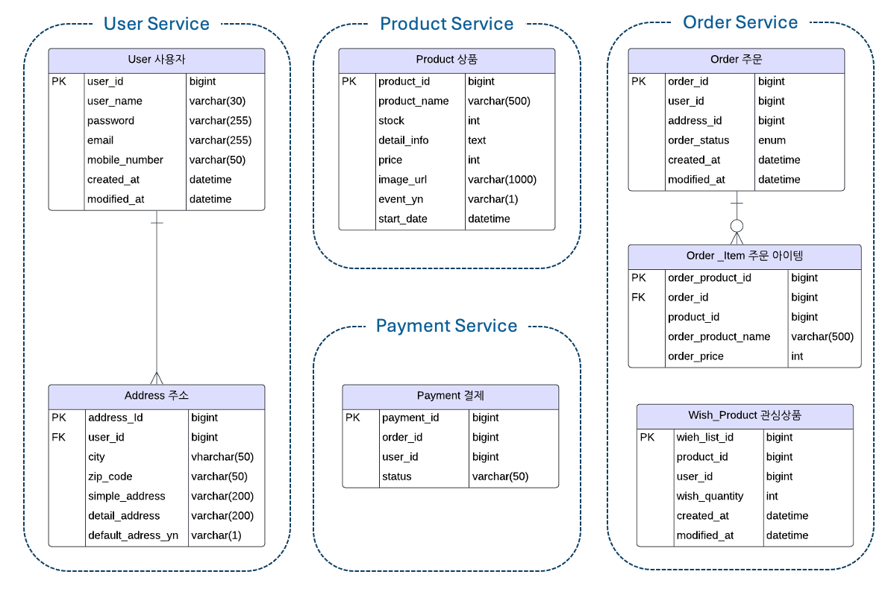

🏕 Collaboration Limited Edition 프로젝트
====
프로젝트 소개 
----
***MVP 기간: 2024.12.18 ~ 2025.01.15***
- 캠핑 브랜드와 패션 브랜드의 콜라보 `한정판 상품` 판매/구매 서비스
- 사용자는 브랜드에서 올린 콜라보 한정판 상품을 정해진 시간에 준비된 재고만큼 `선착순`으로 구매
- `MSA` 환경에서의 대용량 주문 처리를 위한 `성능 개선` 및 `동시성 처리`, `이벤트 기반 프로그래밍` 구현

### ⚙️ 기술 스택
#### Backend
        

#### DB
 

#### DevOps
   

#### Testing
   

### 🧐 기술 스택에 대한 고민

- [`MSA` 가 꼭 필요할까?](https://velog.io/@jnissi92/msa)
  - `MSA` 는 무엇이고 왜 필요할까?
  - 이번 프로젝트에서 `MSA` 를 도입한 이유는?
- [MSA 환경에서 `도커` 구성하기](https://velog.io/@jnissi92/MSA-docker-dockercompose)
  - 각 서비스별로 Dockerfile 관리
  - DB, Kafka, Application 서비스 별 docker-compose.yml 구성
- [MSA 각 서비스는 어떻게 서로를 `식별`할까?(feat.Spring Cloud Eureka)](https://velog.io/@jnissi92/MSA-SpringCloudEureka)
  - Spring Cloud Eureka 란 무엇인가?
  - Spring Cloud Eureka 는 왜 필요할까?
- `API Gateway` 도입 후 인증, 인가는 어디서?
  - SRP 관점에서 바라보는 인증, 인가
- `Redis` 의 다양한 활용법
  - [Redis 란 무엇인가?](https://velog.io/@jnissi92/%EB%A0%88%EB%94%94%EC%8A%A4Redis)
  - [Redis 를 프로젝트에 어떻게 적용할까?](https://velog.io/@jnissi92/howtouseredis)
- `이벤트 기반` 아키텍처란?(feat.Kafka)
  - 서비스간 결합도 낮추기
  - MSA 에서 다른 서비스에 장애가 일어난다면?
- [`JPA` 어디까지 깊어지나](https://velog.io/@jnissi92/series/JPA)

### 🩻 시스템 아키텍처

### 🏗 ERD

주요 기능 및 기술적 구현
---

> ### Test Environment
> - **CPU:** 2.0 GHz Quad-Core Intel Core i5
> - **RAM:** 16 GB 3733 MHz LPDDR4X
> - Network: Localhost environment
### 📦 1분 동안 27만 번 조회, 막힘 없는 정확한 재고 조회
>상황: 힙 브랜드와의 콜라보 체어 100 판매 이벤트로 인해 일주일 전부터 해당 상품에 대한 조회와 재고에 대한 조회 트래픽이 점점 증가하고 있다. 
점점 더 많은 트래픽이 발생될 것이 예상되며 기존의 Database 에 직접 접근하여 조회 하는 방법에는 한계가 있다. 이를 처리하기 위해 조회 성능 향상이 필요하다.
- 효율적인 재고 읽기를 위해서 Redis 를 이용한 재고 캐싱 처리 적용
  - 상품 저장 시 MySQL, Redis 동시 저장
  - 상품 재고 Read 시에 Redis 에 있는 상품 재고 정보 조회
  - 주문 결제 진입 시 Redis 재고 감소
  - 상품 구매 확정 시 MySQL 재고 감소
- 1분 동안 27만건 요청에 대해 99% 퍼센트로 1초 이내 응답(TPS: 3906)

#### 상품 재고 캐싱 적용 이전과 성능 비교
|             | AS-IS  | TO-BE  | 설명                                                   |
|-------------|--------|--------|------------------------------------------------------|
| HTTP 요청 성공률 | 95%    | 100%   | 캐싱 전 일부 요청 실패 → 요청에 대해 100% 성공: 대용량 트래픽에서도 안정적으로 응답  |
| 평균 응답 시간    | 10.87초 | 0.252초 | 트래픽이 한 번에 몰려 평균 응답 시간이 느렸지만 캐싱 적용 후 안정적으로 0.25 초 만에 응답 |
| 1초 이내 응답 비율 | 13%    | 99%    | 응답 시간 또한 캐싱 처리 후 99% 요청에 대해 1초 이내 처리                 |
| 실패율         | 4.82%  | 0%     | 안정적으로 요청을 처리함으로 요청에 대한 실패율 0%                        |
| TPS         | 385    | 3906   | TPS 1000% 향상 되었음                                   |

### 🦠 동시에 8500건 주문, 결제 요청에도 안정적인 재고 관리(동시성 처리 및 상품 재고의 원자적 관리)
>상황: 이벤트 오픈 시간이 되면 동시에 많은 사용자가 주문 및 결제 요청을 할 것으로 예상된다. 이를 위해 아래의 프로세스 및 재고의 정합성 보장이 필요하다.
> 1. 사용자가 주문을 시작하면 30분 동안은 해당 재고를 점유 하고 있으며, 결제 완료 시에 실제 재고를 감소시킨다.
> 2. 30분 안에 결제를 완료하지 않으면 재고 점유는 취소 된다.
> 3. 주문이 폭주하는 상황에서 재고의 정합성이 유지 되어야 하고, 재고가 소진되면 다른 사용자는 주문할 수 없다.

#### 1. 주문 & 결제 프로세스
- Redis TTL 을 이용한 재고 점유(예약) 처리
- 예약 시에는 Redis 캐싱 되어 있는 상품의 재고 감소
- 예약 시간(30분) 안에 결제 처리가 없으면 예약 취소(TTL 만료)
- 예약 취소 시 TTL 만료 이벤트 수신하여 Redis 캐싱 재고 복구

#### 2. 동시에 여러 주문이 들어올 경우 동시성 처리: 재고의 정합성 유지 및 재고 원자적 관리
- Redis 재고 확인과 재고 감소 처리 타이밍의 차이로 인해 동시에 여러 요청이 들어올 경우 재고의 정합성 보장이 안될 수 있음
- Redisson 을 활용하여 분산락 처리 적용: 재고 확인, 재고 감소 처리를 분산락 처리하여 재고를 원자적으로 관리
- 동시성 처리 관련 내용 더 보기

### 💵 이벤트 기반 프로그래밍: 결제 완료 이벤트 & 이벤트 수신 처리 / 성능 개선
>상황: 결제 완료 처리에 따른 데이터 정합성이 보장 되어야 한다.
> 1. 사용자가 결제 완료 처리 요청을 보내면 예약 만료되지 않고 결제 완료 처리 된다.
> 2. 결제 완료 이벤트에 따른 상품 재고 감소
> 3. 결제 완료 이벤트에 따른 주문 완료 상태 변경

#### 1. 결제 완료 프로세스
- Payment Service: 결제 완료 상태 변경 이벤트 발생
- Product Service: 결제 완료 이벤트 수신 → MySQL 실 재고 감소
- Order Service: 결제 완료 이벤트 수신 → 주문 상태 변경
- Kafka 를 통한 이벤트 발생 및 수신 처리
- 이벤트 기반 아키텍처 내용 더 보기

#### 2. 주문-결제 성능 개선
- 이벤트 상품 캐싱 처리 
  이벤트 상품 저장 시 레디스에 저장하여서 추후 이벤트 상품 주문 시 레디스에서 상품 존재 및 재고 확인
- 트랜잭션 분리 
  저장 하는 로직과 레디스로 예약 처리하는 로직을 분리하여 트랜잭션 범위를 줄임
- 카프카 비동기 처리 
  이벤트 발생 부분을 비동기로 처리
- 레디스 I/O 최소화 
  상품 존재 및 재고를 한번에 데이터를 가져와서 레디스 I/O 개수 최소화
- 성능 개선 내용 더 보기

#### 3. 주문-결제 성능 비교
|  | AS-IS      | TO-BE     | 설명            |
| --- |------------|-----------|---------------|
| 평균 응답 시간 | 1021.41 ms | 623.49 ms | 38.96% 개선     |
| TPS | 48.2       | 81.3      | TPS 68.67% 개선 |

트러블 슈팅
---
### 1. 재고 관련 로직의 오류
- 기존 주문 로직
  - 상품 주문 → 주문 생성 → 주문 아이템 생성 → 주문 생성 이벤트 발행 → Product Service 재고 감소, Payment Service 결제 진입
  - 주문 아이템 생성 시: Redis 재고 체크
  - 주문 생성 이벤트 발행: Kafka 이벤트 발행, Product Service, Payment Service 이벤트 리스닝
  - Product Service 재고 감소: Redis 재고 감소, MySQL 재고 감소 → 분산락 처리
- 주문-결제 테스트 중 문제 발생
  - 10개 씩 110 번 동시에 주문 테스트 결과: 기대값 0 / 결과값 0
  - 상품 Entity 재고 0 체크 로직으로 인해 테스트 통과
  - Order 테이블과 Order Product 테이블에 기대와 다른 데이터 존재
- 문제 원인
  - 주문 아이템 생성 시 Redis 에서 재고를 체크 하는 시점과 Product Service 에서 카프카 메시지 수신하여 재고 감소하는 시점이 일치하지 않음
### 2. 해결
재고 예약 기반 관리 도입
- 주문 서비스: Redis 에서 현재 재고를 읽고 재고가 있다면 재고 점유(예약)
- 예약 성공 시 주문 확정 단계로 진행
  - 예약이 성공하면 주문 진행, 최종 결제 완료 시 MySQL 실 재고 반영
- 예약 만료 처리
  - 주문이 취소되거나 일정 시간이 지나면 예약을 해제하고 재고 복구

수정된 로직에서 예약 시간 만료 후 재고 복구는 어떻게 처리?
- Redis 의 TTL 과 만료 이벤트를 수신하여 예약 시간 만료 시 Redis 에서 재고 감소 했던 상품 재고 복구 처리
- 관련 내용 더 보기

더 고민해야 할 부분
---
1. MSA 환경에서 트랜잭션 처리는 어떻게? SAGA 패턴이란 무엇인가
2. MSA 프로젝트를 CI/CD 하기 위한 전략은?