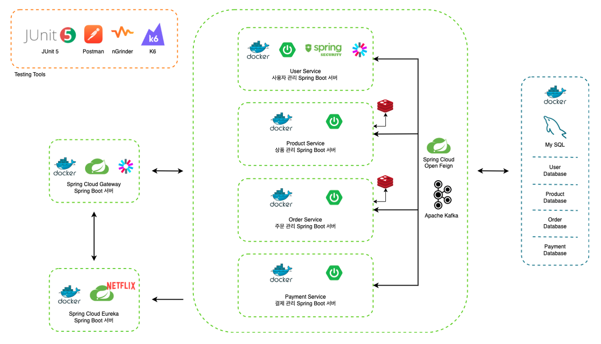

🏕 Collaboration Limited Edition 프로젝트
====
프로젝트 소개 
----
***2024.12.18 ~ 2025.01.15***
- 캠핑 브랜드와 패션 브랜드의 콜라보 한정판 상품 판매/구매 서비스
- 사용자는 브랜드에서 올린 콜라보 한정판 상품을 정해진 시간에 준비된 재고만큼 선착순으로 구매

### ⚙️ 기술 스택
#### Backend

#### DB

#### DevOps

#### Testing

### 🧐 기술 스택에 대한 고민

- `MSA` 가 꼭 필요할까?
- `이벤트 기반` 아키텍처란?(feat.Kafka)
- MSA 환경에서 `도커` 구성하기
- MSA 각 서비스는 어떻게 서로를 `식별`할까?(feat.Eureka)
- `API Gateway` 도입 후 인증, 인가는 어디서?
- `Redis` 의 다양한 역할
- `JPA` 어디까지 깊어지나

### 🩻 시스템 아키텍처

주요 기능 및 기술적 구현
---

> ### Test Environment
> - **CPU:** 2.0 GHz Quad-Core Intel Core i5
> - **RAM:** 16 GB 3733 MHz LPDDR4X
> - Network: Localhost environment
### 📦 Product Service: 1분 동안 27만 번 조회, 막힘 없는 정확한 재고 조회
이벤트 상품 판매가 시작되면 많은 트래픽이 동시에 몰릴 것으로 예상 → 막힘 없이 재고에 대한 정보를 전달해야 할 필요성 재고 
- 효율적인 재고 읽기를 위해서 Redis 를 이용한 재고 캐싱 처리 적용
  - 상품 저장 시 MySQL, Redis 동시 저장
  - 상품 재고 Read 시에 Redis 에 있는 상품 재고 정보 조회
  - 주문 결제 진입 시 Redis 재고 감소
  - 상품 구매 확정 시 MySQL 재고 감소
- 1분 동안 27만건 요청에 대해 99% 퍼센트로 1초 이내 응답(TPS: 3906)

#### 상품 재고 캐싱 적용 이전과 성능 비교
|  | Database 직접 조회 | Redis 캐싱 적용 후 | 설명                                                    |
| --- | --- |---------------|-------------------------------------------------------|
| HTTP 요청 성공률 | 95% | 100%          | 캐싱 전 일부 요청 실패 → 요청에 대해 100% 성공: 대용량 트래픽에서도 안정적으로 응답   |
| 평균 응답 시간 | 10.87초 | 0.252초        | 트래픽이 한 번에 몰려 평균 응답 시간이 느렸지만 캐싱 적용 후 안정적으로 0.25 초 만에 응답 |
| 1초 이내 응답 비율 | 13% | 99%           | 응답 시간 또한 캐싱 처리 후 99% 요청에 대해 1초 이내 처리                  |
| 실패율 | 4.82% | 0%            | 안정적으로 요청을 처리함으로 요청에 대한 실패율 0%                         |
| TPS | 385 | 3906          | TPS 성능 1000% 향상 되었음                                   |

### 동시성 처리